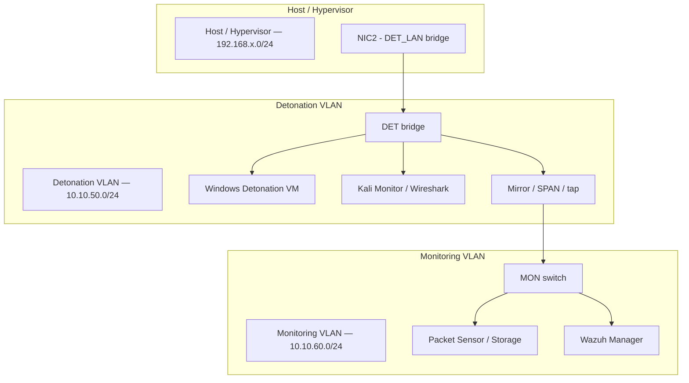

# Cyber Security Lab — Detonation Workstation & Monitoring

---

## Overview
This repository documents my personal Cyber Security Lab — an isolated environment built for safely detonating and analyzing malicious software.  
The lab is designed to observe attacker behavior, persistence mechanisms, and network activity **without containment interference**, allowing for complete visibility into every process, connection, and file change.

The goal of this project is to demonstrate safe, transparent methods for studying real-world malware activity inside a controlled and repeatable home-lab setup.

---

## Purpose
- Capture full endpoint and network telemetry during malware execution.  
- Build repeatable analysis procedures using open-source tools.  
- Study post-infection behavior (lateral movement, persistence, C2) in a secure, air-gapped lab.  
- Develop standardized playbooks for evidence collection and reporting.  

This environment is strictly for **research and education** — it is **not** used for production workloads or offensive operations.

---

## High-Level Setup
The lab runs fully isolated from my home and production networks.

- **Firewall:** OPNsense controlling all VLANs and outbound access.  
- **Virtualization:** libvirt/KVM for hypervisor isolation.  
- **Networks:**  
  - Detonation VLAN (Windows sandbox)  
  - Monitoring VLAN (Kali, Wazuh manager, Linux sensor)  
- **Telemetry:**  
  - Wazuh (agent → manager) for system and process monitoring.  
  - Wireshark/tshark on the Linux sensor for packet capture.  
- **Storage:** Immutable local storage for PCAPs and logs.  
- **Transfer:** Artifacts moved manually or over encrypted channels only after hashing and validation.

No internet traffic leaves the detonation network except where explicitly allowed for observation and capture.

---

## What This Repository Contains
This repository is organized into separate sections for clarity:

| Folder | Description |
|:--|:--|
| `/docs` | Detailed guides, firewall rules, and runbooks. |
| `/scripts` | Shell scripts for starting captures and collecting artifacts. |
| `/templates` | Markdown templates for analysis reports and note-taking. |

Screenshots, live samples, or raw captures are **not** included to maintain security and compliance.

---

## Safety & Legal Notice
- This environment is for **controlled research only**.  
- Always isolate detonation systems from production networks and personal devices.  
- Never upload live malware or PCAPs containing sensitive data to public services.  
- Verify that all actions comply with applicable laws and organizational policies.  
- Treat all data generated within the lab as **potentially hazardous** — handle and store accordingly.  
- Do not reuse credentials, join domains, or share storage with non-lab systems.  

---

## Disclaimer
Use this information and configuration at your own risk.  
The author assumes no responsibility for misuse or damages resulting from replication of this lab setup.  
All content is provided for educational and defensive research purposes only.

---

## 📘 Documentation Index

### Guides
- [Runbook](./docs/runbook.md)
- [Safe Handling](./docs/safehandling.md)
- [Firewall Rules (OPNsense)](./docs/firewall_rules_opnsense.md)

### Scripts
- [Start PCAP Capture](./scripts/start_pcap.sh)
- [Collect Artifacts](./scripts/collect_artifacts.sh)

### Templates
- [Sample Analysis Template](./templates/sample_analysis_template.md)
- [Live Notes Template](./templates/notes_template.md)

---

## Network Layout 

© 2025 Jeremy Tarkington — All Rights Reserved.
